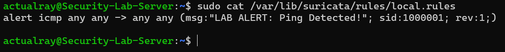
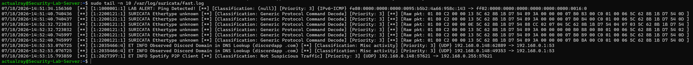

# Open-Source IDS Deployment & Detection Engineering Lab

## Overview
This project walks through the deployment, configuration, and validation of an open-source Intrusion Detection System (Suricata) inside a Linux-based virtualized laboratory environment
My goal was to have complete visibility into network interface traffic and to architect custom rules to flag specific protocol behaviors.

## Tech Stack & Environment
- **Operating System:** Ubuntu Server 24.04 LTS
- **Hypervisor:** Oracle VM VirtualBox
- **Security Tools:** Suricata IDS Engine
- **Core Concepts:** Network Sniffing, Detection Engineering, Traffic Routing, System Logging

## Phase 1: Installation & Interface Alignment
- I started by installing the Suricata engine and proceeded with configuring the main YAML file to point directly to the active physical bridge interface (enp0s3).
- Using the Linux system utilities, I ensured that the engine is monitoring traffic in real time to verify the service stability.

## Phase 2: Custom Rule Development
- Developed a baseline detection signature targeting ICMP (ping) traffic:
`alert icmp any any -> any any (msg:"LAB ALERT: Ping Detected!"; sid:1000001; rev:1;);
- Appended the custom rule directly into the master rulebook at `/var/lib/suricata/rules/suricata.rules`. 


## Phase 3: Traffic Generation & Log Verification
- During testing the rule I configured, I noticed that my pings to my server did not show up. After searching, I realized that Linux OS shortcuts internal traffic; therefore, I had to ping an external IP (8.8.8.8) in order to force the packets to pass the network card where Suricata is able to see them.
- I checked the fast.log file right after sending the ping, and it confirmed that Suricata caught the ping in both directions, showing my server's IP and Google's IP.


## Challenges Overcome & Lessons Learned 
- Challenge 1: I tried testing Suricata after writing my rule and restarting it by pinging my server's own IP address. After checking the logs and expecting to see an alert, Suricata failed to catch the ping, or so I thought.
- The Catch: After the research I did, I found out more about how networking in Linux works. I learned that pinging your own machine lets the system use a shortcut to send traffic internally to not waste time travelling out to the network card, therefore, Suricata which works on my network card interface (enp0s3) will be blind to the pings.
- The fix: I had to force the packets I want to send to leave my machine, simply by pinging an external IP address, and I used Google's IP address (8.8.8.8) instead of my own server's IP address. After my external ping, Suricata caught it and generated my custom alert successfully.

- Challenge 2: When my alerts failed to show in the logs, my immediate thought was to check if I had messed up the rule syntax or if i had not saved it properly.
- The fix: Instead of guessing what went wrong and having a chance of messing up the configurations, I decided to verify my files first. I ran `sudo tail -n 5` on the master rulebook file `(/var/lib/suricata/rules/suricata.rules)` to check what was written at the bottom. Seeing the custom rule there confirmed that the configuration I made was not the issue. This allowed me to focus on other things that might be the problem instead of second-guessing the syntax and focus mainly on troubleshooting the network traffic itself.


## Technical Reference & Core Commands
If you are looking to replicate this lab, these are the three main commands I used in the deployment and verification phases:

*   **Rule Configuration:** Custom detection signatures were appended to the local rules engine definition file:
    ```bash
    sudo nano /var/lib/suricata/rules/local.rules
    ```
*   **Engine Verification:** Validated the rule syntax integrity before restarting the engine thread:
    ```bash
    sudo suricata -T -c /etc/suricata/suricata.yaml -v
    ```
*   **Log Inspection:** Monitored the real-time alert generation pipeline via standard output streams:
    ```bash
    tail -f /var/log/suricata/fast.log
    ```

    ## Future Enhancements & Scalability
    This deployment successfully validates localized signature detection and rule engineering; the architecture can be scaled vertically and horizontally for enterprise environments:
    1.  **Distributed Log Ingestion (SIEM Pipeline):** The logical next phase involves transitioning from localized flat-file logging (`fast.log`) to structured JSON telemetry distribution. Shipping `/var/log/suricata/eve.json` via a lightweight log forwarder (like Filebeat) into a centralized open-source SIEM (such as Wazuh or an ELK stack) will enable comprehensive dashboard visualizations, cross-log correlation, and long-term retention.
    2.  **Advanced Rulesets & Behavioral Profiling:** Expand beyond basic ICMP tracking by implementing complex multi-layered rules targeting malicious user-agent strings, unauthorized DNS tunneling detection, and basic cross-site scripting (XSS) payload patterns.
